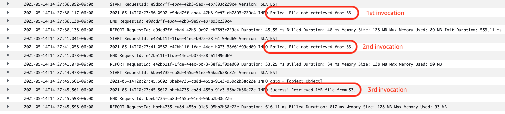
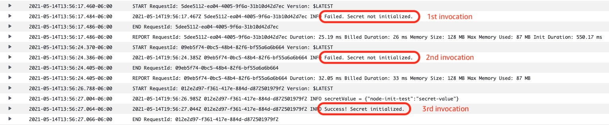
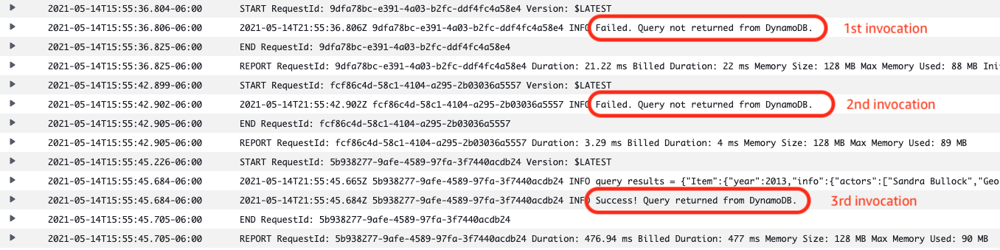
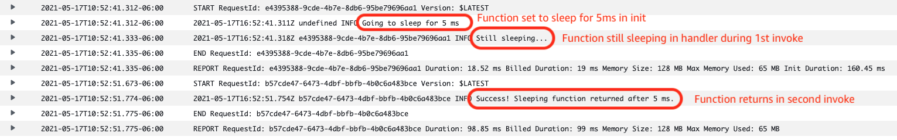

# node-init-tester

This application creates simple tests to illustrate when common asynchronous initialization tasks are completed by the Node.js runtime within AWS Lambda.

- test1 - Loads a 1MB file from S3 in init code
- test2 - Retrieves a secret from Secrets Manager in init code
- test3 - Gets an item from DynamoDB in init code
- test4 - Sleeps for 5ms

In most test scenarios the aynchronous function does not load until the 3rd invocation.

test1 results:

test2 results:

test3 results:

test4 results:

